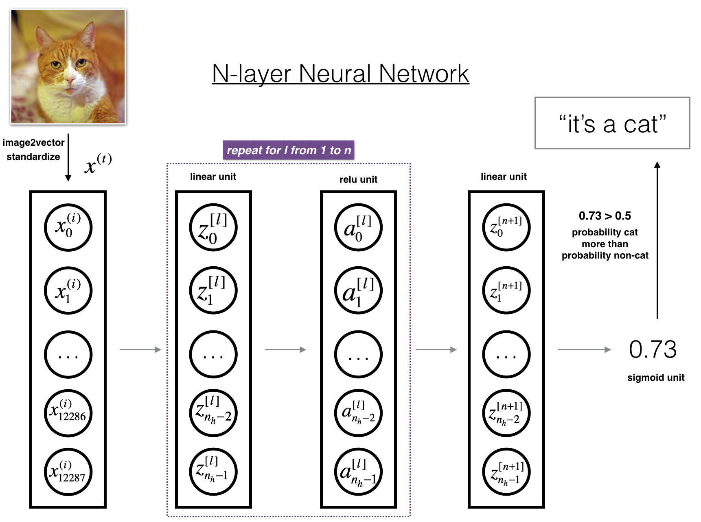

# 第一课_第四周学习笔记
---
**内容概要：**
1. Parameters vs Hyperparameters
2. 为什么用深度神经网络（why deep presentation）
3. 逐步实现深度神经网络
4. 确定各层参数矩阵维度 & 随机初始化
5. 使用tensorflow实现深度神经网络


### 0 - 符号约定
|符号|含义|
|:---:|:---|
|$L$|层数|
|上标 $[l]$|a quantity associated with the $l^{th}$ layer|
|$n^{[l]}$|第 $l$ 层 的神经元数量|
|$a^{[l]}$|第 $l$ 层的激活函数计算结果|
|$W^{[l]}$|the $l^{th}$ layer weights|
|$b^{[l]}$|the $l^{th}$ layer biases|
|上标 $(i)$|a quantity associated with the $i^{th}$ example|
|$x^{(i)}$|the $i^{th}$ training example|
|下标 $i$|the $i^{th}$ entry of a vector|
|$a^{[l]}_i$ |the $i^{th}$ entry of the $l^{th}$ layer's activations.|


### 1 - 参数（Parameters） & 超参 （HyperParameters）
---
参数是模型内部的配置变量，可以通过训练数据估计参数的值；超参是模型外部的配置，必须手动设置参数的值。由于超参的设置对参数会产生非常大的影响，因此，超参可以理解成控制参数的参数。事实上，使用不同的超参配置进行神经网络训练，得到的结果可能会大相径庭。 

常见的参数有：W，b等

常见的超参有：learning rate，iterations number， hidden layer number，hidden unit number等。


### 2 - 为什么用深度神经网络（why deep presentation）
---
>Informally：There are functions you can compute with a "small" L-layer deep neural network that shallower networks require exponentially more hidden units to compute.

上面这句话的意思就是，在神经网络中，针对复杂函数的逼近，增加层数会比增加神经元更有效。

直观上理解，增加层数能够表达更多的信息，而增加单层的神经元数量，对于信息的表达提升能力有限。以CNN（卷积神经网络）进行图片识别任务为例，针对目标的识别层层递进，第一个隐含层检测边缘，第二个隐含层检测目标的组件，第三个隐含层就可以看到目标的轮廓了。如果在第一个隐含层增加神经元数量，仅仅是增加了边缘检测的正确率，依然不能检测图片中的组件。

### 3 - 逐步实现深度神经网络
---
假设需要实现的深度神经网络层数为$L$（隐含层数量为$L-1$），首先，随机初始化各层的参数；其次是向前传播过程，这里要注意的是，隐含层要使用ReLU激活函数，防止深度增加造成梯度消失；接着计算loss；然后是向后传播过程，这个过程的激活函数要和向前传播过程一致；接着由梯度下降法更新参数；【向前传播】-【计算loss】-【向后传播】-【更新参数】是一个循环，需要迭代计算num_iterations次；最后是用训练好的模型在测试集上进行预测。

其实现框架图如下：

<caption><center> **深度神经网络实现框架**</center></caption><br>

前向传播过程的一种简介表示方法： *[LINEAR -> RELU] $\times$ (L-1) -> LINEAR -> SIGMOID*

---
因此，使用Python实现上图所示的深度神经网络框架，需要完成6个部分的内容：
- 随机初始化$L$-layer neural network的参数
- 实现向前传播（forward propagation）模块（上图紫色部分）
     - 单层线性方程组计算，结果保存为 $Z^{[l]}$
     - 激活函数 (relu/sigmoid)
     - 将以上两步组合成一个新的 [LINEAR->ACTIVATION]向前传播函数
     - 堆叠向前传播函数：[LINEAR->RELU] 重复 L-1次，表示第1至L-1层，即所有隐含层；在后面加上一个[LINEAR->SIGMOID]，表示第L层，也就是输出层
- 计算loss
- 实现向后传播（backward propagation）模块（上图红色部分）
    - 向后传播过程主要是计算当前参数的loss函数梯度
- 更新参数
- 预测函数

上面6个部分的python实现与之前写的单隐层神经网络大同小异，值的注意的是各层参数矩阵的维度变化。

**Note：** 以上摘自本周课程作业，完整的python实现过程，请查看课程作业！

### 4 - 确定各层参数矩阵维度 & 随机初始化
---
与单隐层神经网络一样，深度神经网络的参数初始化也必须是随机的，**绝对不能将所有参数初始化为0**。通常，使用标准正态分布来初始化$W$参数，$b$可以初始化为0。

对于深度神经网络而言，参数初始化的另外一个难点是确定每一层的参数矩阵维度，这里非常容易出错。假设输入数据集$X$的大小为$(12288, 209)$ (with $m=209$ examples)，那么各层参数矩阵维度可以用下表表示：


<table style="width:100%">


    <tr>
        <td>  </td> 
        <td> **Shape of W** </td> 
        <td> **Shape of b**  </td> 
        <td> **Activation** </td>
        <td> **Shape of Activation** </td> 
    <tr>
    
    <tr>
        <td> **Layer 1** </td> 
        <td> $(n^{[1]},12288)$ </td> 
        <td> $(n^{[1]},1)$ </td> 
        <td> $Z^{[1]} = W^{[1]}  X + b^{[1]} $ </td> 
        
        <td> $(n^{[1]},209)$ </td> 
    <tr>
    
    <tr>
        <td> **Layer 2** </td> 
        <td> $(n^{[2]}, n^{[1]})$  </td> 
        <td> $(n^{[2]},1)$ </td> 
        <td>$Z^{[2]} = W^{[2]} A^{[1]} + b^{[2]}$ </td> 
        <td> $(n^{[2]}, 209)$ </td> 
    <tr>
   
       <tr>
        <td> $\vdots$ </td> 
        <td> $\vdots$  </td> 
        <td> $\vdots$  </td> 
        <td> $\vdots$</td> 
        <td> $\vdots$  </td> 
    <tr>
    
   <tr>
        <td> **Layer L-1** </td> 
        <td> $(n^{[L-1]}, n^{[L-2]})$ </td> 
        <td> $(n^{[L-1]}, 1)$  </td> 
        <td>$Z^{[L-1]} =  W^{[L-1]} A^{[L-2]} + b^{[L-1]}$ </td> 
        <td> $(n^{[L-1]}, 209)$ </td> 
    <tr>
    
    
   <tr>
        <td> **Layer L** </td> 
        <td> $(n^{[L]}, n^{[L-1]})$ </td> 
        <td> $(n^{[L]}, 1)$ </td>
        <td> $Z^{[L]} =  W^{[L]} A^{[L-1]} + b^{[L]}$</td>
        <td> $(n^{[L]}, 209)$  </td> 
    <tr>

</table>


其中，$n^{[l]}$ 表示第 $l$ 层的神经元数量。仔细观察上表，可以发现，第$l$层的变量维度：
$$W^{[l]}: (n^{[l]}, n^{[l-1]})$$
$$b^{[l]}: (n^{[l]}, 1)$$


### 5 - TensorFlow实现深度神经网络
---
ng在本周课程编程作业中提供了cat数据集和以下用于识别图片中是否有猫的深度神经网络模型。


下面用TensorFlow来实现，代码如下：


```python
import h5py
import numpy as np
import tensorflow as tf

# 读入数据集
train_dataset = h5py.File('datasets/train_catvnoncat.h5', "r")
train_set_x_orig = np.array(train_dataset["train_set_x"][:]) #  train set features  (209, 64, 64, 3)
train_set_y_orig = np.array(train_dataset["train_set_y"][:]) #  train set labels (209, 0)

test_dataset = h5py.File('datasets/test_catvnoncat.h5', "r")
test_set_x_orig = np.array(test_dataset["test_set_x"][:]) # test set features (50, 64, 64, 3)
test_set_y_orig = np.array(test_dataset["test_set_y"][:]) # test set labels (50, 0)

classes = np.array(test_dataset["list_classes"][:]) # the list of classes

train_set_y_orig = train_set_y_orig.reshape((1, train_set_y_orig.shape[0]))
test_set_y_orig = test_set_y_orig.reshape((1, test_set_y_orig.shape[0]))

# Reshape the training and test examples 
train_x_flatten = train_set_x_orig.reshape(train_set_x_orig.shape[0], -1).T   
# The "-1" makes reshape flatten the remaining dimensions
test_x_flatten = test_set_x_orig.reshape(test_set_x_orig.shape[0], -1).T

# Standardize data to have feature values between 0 and 1.
train_x = train_x_flatten/255.
test_x = test_x_flatten/255.
```


```python
# 启用tensorboard
import os

if not os.path.exists('log'):
    os.mkdir('log')
    
logdir = os.path.join(os.getcwd(), 'log')
print('启用tensorboard，请复制以下代码(port可以修改)到cmd中，执行：\n',
      'tensorboard --logdir=%s --port=6068' % logdir)
```

    启用tensorboard，请复制以下代码(port可以修改)到cmd中，执行：
     tensorboard --logdir=C:\Users\Mike\Documents\Blog\notes_deeplearning.ai\log --port=6068
    


```python
# 定义网络结构 
layers_dims = [12288, 20, 7, 5, 1]  
# 输入层（第一个数字）和输出层（最后一个数字）不能修改，中间的隐含层可以修改，
# 在中间增加数字就是增加隐含层，数字表示隐含层神经元数量
train_size = train_set_x_orig.shape[0]
L = len(layers_dims)


# 随机初始化参数（单层）
def init_parameters(shape):
    W = tf.get_variable('W', shape, initializer=tf.truncated_normal_initializer(stddev=0.1, seed=1))
    b = tf.get_variable('b', shape=(shape[0],1) , initializer=tf.constant_initializer(0.0))
    return W, b

# 前向传播
def L_forward_propagation(X, L):
    for i in range(1, L-1):
        if i == 1:
            A_pred = X
        else:
            A_pred = A
        with tf.variable_scope('hidden_layer'+str(i)):
            W, b = init_parameters(shape=(layers_dims[i], layers_dims[i-1]))
            A = tf.nn.relu(tf.matmul(W, A_pred) + b)
    # output layer
    with tf.variable_scope('output_layer'):
        W, b = init_parameters(shape=(layers_dims[L-1], layers_dims[L-2]))
        Y = tf.matmul(W, A) + b  # 这里输出的是线性方程计算结果，并没有经过激活函数
    return Y

# 输入数据
with tf.name_scope('input_layer'):
    X = tf.placeholder(tf.float32, shape=(layers_dims[0], train_size), name='X')
    y_ = tf.placeholder(tf.float32, shape=(layers_dims[-1], train_size), name='Y_label')


y = L_forward_propagation(X, L)


# 计算损失函数的命名空间。
with tf.name_scope("loss_function"):
    cross_entropy = tf.nn.sigmoid_cross_entropy_with_logits(logits=y, labels=y_)
    loss = tf.reduce_mean(cross_entropy)


# 训练模型
learning_rate = 0.05
train_step = tf.train.GradientDescentOptimizer(learning_rate).minimize(loss)
# train_step = tf.train.AdamOptimizer(learning_rate).minimize(loss)

# 写入计算图到log
summary_writer = tf.summary.FileWriter(logdir, tf.get_default_graph())
summary_writer.close()
```


```python
num_iterations = 1600

with tf.Session() as sess:
    tf.global_variables_initializer().run()
    for i in range(num_iterations):
        _, total_loss,  = sess.run([train_step, loss ], feed_dict={X: train_x, y_: train_set_y_orig})
        if i % 100 == 0:
            print("After %i training step(s), loss on training set is %s." % (i, str(total_loss)))
```

    After 0 training step(s), loss on training set is 0.693251.
    After 100 training step(s), loss on training set is 0.644346.
    After 200 training step(s), loss on training set is 0.634704.
    After 300 training step(s), loss on training set is 0.564144.
    After 400 training step(s), loss on training set is 0.585186.
    After 500 training step(s), loss on training set is 0.426819.
    After 600 training step(s), loss on training set is 0.381561.
    After 700 training step(s), loss on training set is 0.495546.
    After 800 training step(s), loss on training set is 0.341763.
    After 900 training step(s), loss on training set is 0.376317.
    After 1000 training step(s), loss on training set is 0.663143.
    After 1100 training step(s), loss on training set is 0.433534.
    After 1200 training step(s), loss on training set is 0.183415.
    After 1300 training step(s), loss on training set is 0.887958.
    After 1400 training step(s), loss on training set is 0.163736.
    After 1500 training step(s), loss on training set is 0.0112102.
    

## 参考资料
---
- [Tensorflow 实战Google深度学习框架 2017](http://download.csdn.net/download/u013003382/9872692)
- [TensorFlow实现与优化深度神经网络](http://www.cnblogs.com/hellocwh/p/5527141.html)
- [译-机器学习填坑：你知道模型参数和超参数之间的区别吗？](https://www.tuicool.com/articles/63eIBfV)
